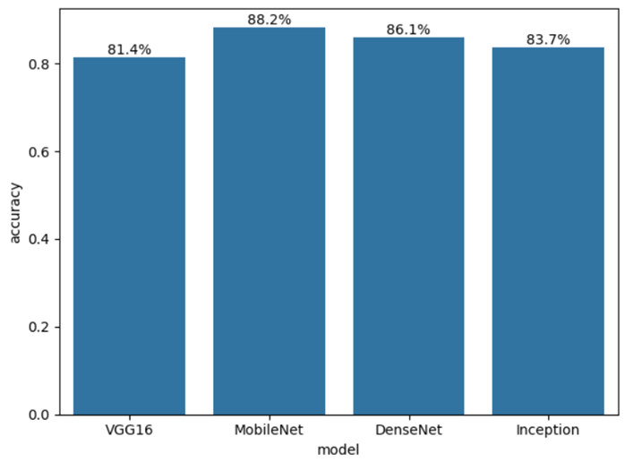

# Capstone-Project

# Lung Opacity Detection (for Pneumonia)

This repository contains deep learning models for detecting lung opacity (whiteness in the lungs) from medical images. The models analyze texture differences between healthy and infected lungs using convolutional neural networks (CNNs).

## Project Overview

The project consists of multiple models trained on medical imaging datasets. It leverages different CNN architectures such as VGG16, ResNet50, InceptionV3, MobileNetV2, and DenseNet121.

## Dataset

The dataset used for training and evaluation includes lung images categorized based on opacity levels. Data preprocessing techniques, including image augmentation and normalization, were applied.

## Dependencies

The following libraries are required to run the notebooks:

```bash
pip install tensorflow keras numpy pandas matplotlib seaborn scikit-learn opencv-python
```

## Model Architectures

The project utilizes the following architectures:
- **Sequential CNN Model** (Custom-built CNN)
- **Pretrained Models**: VGG16, ResNet50, InceptionV3, MobileNetV2, DenseNet121

Each model is fine-tuned and trained using different hyperparameters and optimization techniques.

## Training & Evaluation

- **Data Augmentation**: Applied using `ImageDataGenerator`
- **Training**: Models are trained using categorical cross-entropy loss and Adam optimizer
- **Evaluation**: Performance metrics include accuracy, confusion matrices, and classification reports

## Model Output

Below is an example of model accuracy visualization:



## Usage

1. Clone the repository:
   ```bash
   git clone https://github.com/yourusername/lung-opacity-detection.git
   ```
2. Navigate to the project folder:
   ```bash
   cd lung-opacity-detection
   ```
3. Open and run the Jupyter notebooks:
   ```bash
   jupyter notebook
   ```

## Results

The trained models achieve varying accuracy levels depending on the architecture and dataset preprocessing. Visualizations of training performance and confusion matrices are included in the notebooks.

## Contributors

- Rupam Mal (rupammal25@gmail.com)

## License

This project is licensed under the MIT License.

